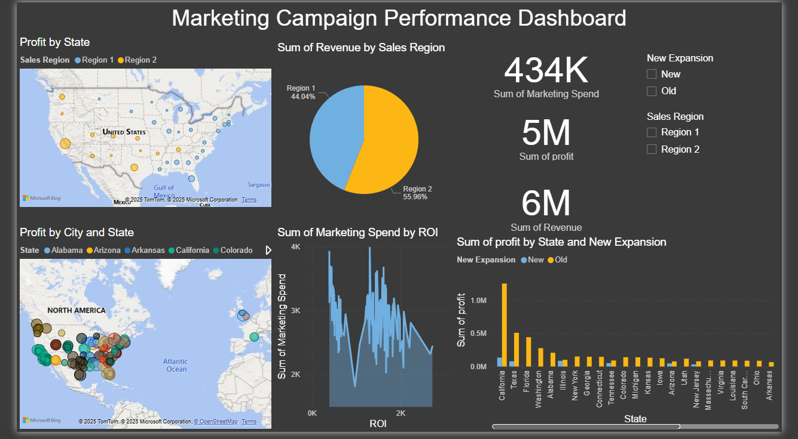

# 🚀 Startup Expansion ROI Analysis

This simple project analyzes the return on investment (ROI) of a marketing campaign conducted by a company expanding its store presence across different cities in the U.S. Using a dataset of over 150 stores, the goal is to evaluate the profitability and efficiency of the campaign based on regional and expansion status data.

---

## 📁 Dataset Overview

- Each row represents a store in a unique city.
- Key columns include:
  - `City`, `State`, `Sales Region`
  - `Marketing Spend`, `Revenue`, `Profit`
  - `New Expansion` (New vs Old store)
  - Calculated fields: `ROI`, `ROI%`

Sample data:

| City      | State      | Marketing Spend | Revenue | Profit | ROI%   |
| --------- | ---------- | --------------- | ------- | ------ | ------ |
| Peoria    | Arizona    | 2601            | 48610   | 46009  | 17.69% |
| Midland   | Texas      | 2727            | 45689   | 42962  | 15.75% |
| Elk Grove | California | 2918            | 49856   | 46938  | 16.09% |

---

## 🔍 Objectives

- Import and clean the dataset using Python.
- Calculate key business metrics: **profit** and **ROI**.
- Explore insights by region and expansion type.
- Build a Power BI dashboard to visualize results.

---

## 🧠 Key Insights

- Calculated total profit and ROI across all stores.
- Compared ROI between **new** and **existing** stores.
- Identified top-performing cities and regions.
- Highlighted underperforming areas for strategic decisions.

